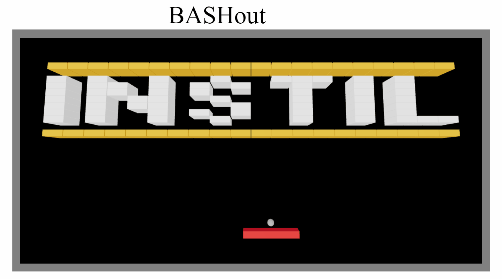

# bashout-kotlinjs

This is a Kotlin for JavaScript demo application using React, Redux and WebGL.
It's a mini-Breakout clone. 

## Running

- Open in IntelliJ (tested with v2021.1.2)
- Run Gradle Task `kotlin-browser/browserDevelopmentRun`
  - `./gradlew browserDevelopmentRun`

## Context

I've used this for a few talks discussing KotlinJS. I wanted to have a bit
of fun so got my kids involved to record the sounds, create the maps and be my QA department.

I work for a company called Instil Software - a Software Development, Consultancy and Training company.
We provide [lots of courses](https://instil.co/training/) including,

- [KotlinJS Workshop](https://instil.co/courses/kotlinjs-workshop/)
- [Introduction to Kotlin](https://instil.co/courses/kotlin-development/)
- [Kotlin Coroutines](https://instil.co/courses/kotlin-coroutines/)
- [Functional Programming in Kotlin with Arrow](https://instil.co/courses/functional-programming-in-kotlin-with-arrow/)
- [Spring Boot Kotlin](https://instil.co/courses/spring-boot-with-kotlin/)
- React with [TypeScript](https://instil.co/courses/react-with-typescript/) or [JavaScript](https://instil.co/courses/react-and-redux/)
- [TypeScript](https://instil.co/courses/typescript-introduction/) and [JavaScript](https://instil.co/courses/javascript-fundamentals/) Language Courses
- and more...

We deliver virtually to companies all over the world and we're
happy to customise our courses to tailor to your team’s level and specific needs.
Come and check us out to see if we can help you and your team.
